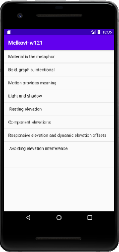

## Сохранение текстового файла
### Задание:

Пора сделать наш список примеров завершенным. Для полноты работы ему не хватает добавления/удаления Sample-ов.

Измените логику формирования списка примеров, переведя ее с SharedPrefs на внешние файлы.

Для этого: создайте внешний файл на своем устройстве и сохраните в него список примеров через символ “;”. Теперь список примеров должен формироваться из этого файла.

Удаление Sample-а тоже должно осуществляться из этого файла.

